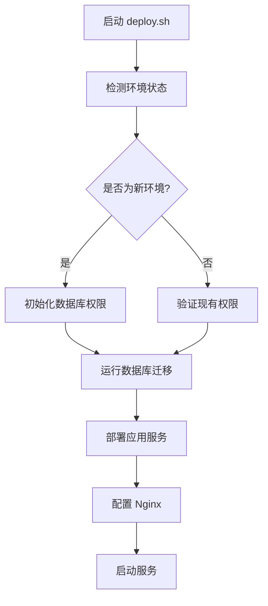

# 环境初始化与权限配置指南

本指南解决新环境部署时的数据库权限问题，实现**完全自动化**的环境初始化。

## 🎯 解决的问题

- ✅ 新机器部署时的数据库权限不足问题
- ✅ `unified_data` 字段缺失导致的迁移失败
- ✅ 手动配置权限的繁琐流程
- ✅ 开发环境与生产环境的配置一致性

## 🚀 开发环境快速初始化

### 方法一：使用 npm 命令（推荐）

```bash
# 进入后端目录
cd backend

# 一键初始化开发环境
npm run init:dev

# 或者使用别名
npm run setup:permissions
```

### 方法二：直接运行脚本

```bash
# 进入后端目录
cd backend

# 直接运行初始化脚本
node scripts/init-dev-environment.js
```

### 🔍 初始化脚本功能

1. **自动检测 PostgreSQL 容器**
2. **配置数据库用户权限**
3. **运行数据库迁移**
4. **初始化种子数据**
5. **验证配置完整性**

### ⚙️ 支持的环境变量

```bash
# 数据库配置
DB_HOST=localhost
DB_PORT=5434
DB_NAME=resume_db
DB_USER=resume_user
DB_PASSWORD=password
```

## 🌟 生产环境自动化部署

### 完全自动化部署

生产环境使用 `deploy.sh` 脚本，已集成环境初始化功能：

```bash
# 标准部署（包含环境初始化）
sudo bash deploy.sh

# 仅运行数据库修复
sudo bash deploy.sh --db-fix-only

# 快速部署模式
sudo bash deploy.sh --mode=quick
```

### 🔧 自动化功能

`deploy.sh` 脚本现在包含：

1. **智能环境检测** - 自动识别新环境
2. **权限自动配置** - 无需手动干预
3. **数据库迁移保障** - 迁移前确保权限正确
4. **失败自动恢复** - 多重备用方案

### 📋 生产环境初始化流程



## 🔒 权限配置详情

### 自动配置的权限

```sql
-- 用户创建与基础权限
CREATE USER resume_user WITH PASSWORD 'resume_password_2024';
ALTER USER resume_user CREATEDB;

-- 数据库权限
GRANT ALL PRIVILEGES ON DATABASE resume_db TO resume_user;

-- Schema 权限
GRANT ALL ON SCHEMA public TO resume_user;

-- 表和序列权限
GRANT ALL PRIVILEGES ON ALL TABLES IN SCHEMA public TO resume_user;
GRANT ALL PRIVILEGES ON ALL SEQUENCES IN SCHEMA public TO resume_user;

-- 未来创建的对象权限
ALTER DEFAULT PRIVILEGES IN SCHEMA public GRANT ALL ON TABLES TO resume_user;
ALTER DEFAULT PRIVILEGES IN SCHEMA public GRANT ALL ON SEQUENCES TO resume_user;
```

### 必要的 PostgreSQL 扩展

```sql
CREATE EXTENSION IF NOT EXISTS "uuid-ossp";
CREATE EXTENSION IF NOT EXISTS "pg_trgm";
```

## 🐛 故障排除

### 常见问题

#### 1. 容器检测失败

```bash
❌ [DEV_INIT] 没有找到运行中的 PostgreSQL 容器
```

**解决方案：**
```bash
# 检查 Docker 容器状态
docker ps

# 启动 PostgreSQL 容器
docker-compose up -d

# 或手动启动
docker run -d --name resume-db \
  -e POSTGRES_DB=resume_db \
  -e POSTGRES_USER=resume_user \
  -e POSTGRES_PASSWORD=password \
  -p 5434:5432 \
  postgres:15-alpine
```

#### 2. 权限初始化失败

```bash
❌ [DEV_INIT] 权限初始化失败
```

**解决方案：**
```bash
# 检查 PostgreSQL 超级用户权限
docker exec <container_name> psql -U postgres -c "SELECT version();"

# 手动执行权限配置
docker exec <container_name> psql -U postgres -c "
  GRANT ALL PRIVILEGES ON DATABASE resume_db TO resume_user;
  ALTER USER resume_user CREATEDB;
"
```

#### 3. 数据库迁移失败

```bash
❌ [DEV_INIT] 数据库迁移失败
```

**解决方案：**
```bash
# 检查 knex 配置
npx knex migrate:status

# 手动运行迁移
npx knex migrate:latest

# 检查数据库连接
node -e "
const { db } = require('./config/database');
db.raw('SELECT 1').then(() => console.log('✅ 连接成功')).catch(console.error);
"
```

### 手动验证步骤

```bash
# 1. 验证 Docker 容器
docker ps | grep postgres

# 2. 验证数据库连接
docker exec <container_name> psql -U resume_user -d resume_db -c "SELECT version();"

# 3. 验证表结构
docker exec <container_name> psql -U resume_user -d resume_db -c "\d resumes"

# 4. 验证迁移状态
cd backend && npx knex migrate:status
```

## 📝 最佳实践

### 开发环境

1. **首次设置**：
   ```bash
   git clone <repository>
   cd resume/backend
   npm install
   npm run init:dev
   npm run dev
   ```

2. **日常开发**：
   ```bash
   # 正常情况下不需要重新初始化
   npm run dev
   ```

3. **环境重建**：
   ```bash
   docker-compose down -v  # 清理数据
   docker-compose up -d    # 重启服务
   npm run init:dev        # 重新初始化
   ```

### 生产环境

1. **首次部署**：
   ```bash
   sudo bash deploy.sh
   ```

2. **版本更新**：
   ```bash
   sudo bash deploy.sh  # 自动检测是否需要权限重配
   ```

3. **问题修复**：
   ```bash
   sudo bash deploy.sh --db-fix-only
   ```

## 🎉 完成标志

### 开发环境成功标志

```bash
✅ [DEV_INIT] 找到 PostgreSQL 容器: <container_name>
✅ [DEV_INIT] 数据库权限初始化成功
✅ [DEV_INIT] 数据库连接验证成功
✅ [DEV_INIT] 数据库迁移成功
✅ [DEV_INIT] 🎉 开发环境初始化完成！

现在可以启动应用了:
  cd backend && npm run dev
  cd frontend && npm start
```

### 生产环境成功标志

```bash
✅ 环境权限初始化成功
✅ 数据库迁移成功
✅ 后端服务启动成功
✅ 前端构建完成
✅ Nginx 配置更新
🎉 部署完成！
```

---

## 📞 技术支持

如果遇到问题，请按以下顺序检查：

1. **检查 Docker 服务状态**
2. **验证环境变量配置**
3. **查看详细错误日志**
4. **参考故障排除部分**

这套自动化解决方案确保了在任何新环境中都能实现**一键部署**，无需手动配置权限！ 🚀 

## 重要修复说明

### 数据库兼容性修复

**问题**: 原始的 `20250703000001_unified_schema_migration.js` 迁移会删除 `resume_data` 字段，但应用代码还在使用此字段，导致定制简历功能失效。

**解决方案**: 
1. 修改迁移文件，保留 `resume_data` 字段以确保向后兼容性
2. 同时添加 `unified_data` 字段支持新的数据格式
3. 确保数据在两个字段中都完整存在

**当前数据库结构**:
- `resume_data` - 文本格式，保留以支持现有代码
- `unified_data` - JSONB格式，新的统一数据格式
- `schema_version` - 数据结构版本标识

### 如果遇到类似问题

如果在部署过程中出现定制简历功能失效，可以按以下步骤排查：

1. **检查表结构**:
   ```bash
   docker exec resume-db psql -U resume_user -d resume_db -c "\d resumes"
   ```

2. **检查数据完整性**:
   ```bash
   docker exec resume-db psql -U resume_user -d resume_db -c "SELECT id, title, CASE WHEN resume_data IS NOT NULL THEN 'OK' ELSE 'Missing' END as resume_data_status FROM resumes LIMIT 5;"
   ```

3. **如果需要回滚迁移**:
   ```bash
   npx knex migrate:rollback
   ```

4. **重新运行修复过的迁移**:
   ```bash
   npx knex migrate:latest
   ``` 