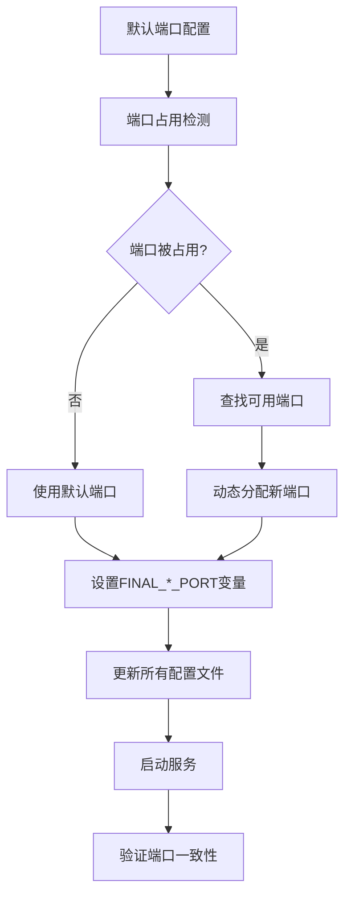

# 端口配置统一解决方案

## 问题总结

从你的部署日志可以看出两个主要问题：

### 1. 端口配置不一致
- **后端实际运行端口**: 8001 (动态分配)
- **前端代理配置端口**: 8000 (硬编码)
- **导致结果**: 前端无法连接到后端 ("ERR_CONNECTION_REFUSED")

### 2. 前端服务ESM错误
- **问题**: 新版本的 `serve` 包是 ESM 模块，与 PM2 fork 模式不兼容
- **症状**: `ERR_REQUIRE_ESM` 错误，服务显示 online 但实际有问题

## 解决方案

### 📋 修改内容

我已经对 `deploy_1.sh` 脚本进行了以下关键修改：

#### 1. **新增动态前端代理配置更新**

```bash
# 在 configure_environment() 函数中新增:
update_frontend_proxy()  # 动态更新 setupProxy.js 文件
```

**功能**:
- 自动备份原代理配置
- 根据 `$FINAL_BACKEND_PORT` 动态生成新的代理配置
- 更新所有测试文件中的硬编码端口
- 确保前端代理指向正确的后端端口

#### 2. **增强前端环境配置**

```bash
# 在前端 .env 文件中增加:
PORT=$FINAL_FRONTEND_PORT
GENERATE_SOURCEMAP=false
DISABLE_ESLINT_PLUGIN=true
```

#### 3. **修复前端服务启动的ESM问题**

```bash
# 优先使用 http-server (更稳定)
npm install -g http-server
pm2 start http-server --name "resume-frontend" -- build -p $FINAL_FRONTEND_PORT

# 备用方案使用固定版本的 serve
npm install -g serve@13.0.4
```

#### 4. **增强端口一致性检查**

添加了对前端代理配置的检查：

```bash
# 检查 setupProxy.js 中的端口配置
PROXY_TARGET_PORT=$(grep -o "localhost:[0-9]*" setupProxy.js)
```

### 🔧 涉及的文件和配置

#### 动态更新的文件：
1. **`frontend/src/setupProxy.js`** - 前端代理配置
2. **`frontend/.env`** - 前端环境变量
3. **`backend/.env`** - 后端环境变量  
4. **`frontend/test-*.html`** - 测试文件
5. **`/etc/nginx/sites-available/resume`** - Nginx配置

#### 端口变量映射：
- `DEFAULT_BACKEND_PORT=8000` → `DETECTED_BACKEND_PORT` → `FINAL_BACKEND_PORT`
- `DEFAULT_FRONTEND_PORT=3016` → `DETECTED_FRONTEND_PORT` → `FINAL_FRONTEND_PORT`
- `DEFAULT_DB_PORT=5434` → `DETECTED_DB_PORT` → `FINAL_DB_PORT`
- `DEFAULT_REDIS_PORT=6379` → `DETECTED_REDIS_PORT` → `FINAL_REDIS_PORT`

### 📊 端口配置流程



## 使用方法

### 方案1: 重新运行更新后的部署脚本（推荐）

```bash
# 1. 停止现有服务
pm2 stop all

# 2. 运行更新后的部署脚本
sudo ./deploy_1.sh

# 脚本会自动：
# - 检测端口占用情况
# - 动态分配可用端口
# - 更新所有相关配置文件
# - 启动服务并验证
```

### 方案2: 手动执行端口配置修复

如果只想修复端口问题，不重新部署：

```bash
# 1. 设置端口变量
FINAL_BACKEND_PORT=8001  # 根据实际情况设置
FINAL_FRONTEND_PORT=3016

# 2. 更新前端代理配置
cat > frontend/src/setupProxy.js << EOF
const { createProxyMiddleware } = require('http-proxy-middleware');
module.exports = function(app) {
  app.use('/api', createProxyMiddleware({
    target: 'http://localhost:$FINAL_BACKEND_PORT',
    changeOrigin: true,
  }));
};
EOF

# 3. 更新前端环境变量
cat > frontend/.env << EOF
REACT_APP_API_URL=http://localhost:$FINAL_BACKEND_PORT/api
PORT=$FINAL_FRONTEND_PORT
GENERATE_SOURCEMAP=false
DISABLE_ESLINT_PLUGIN=true
EOF

# 4. 重新构建并启动前端
cd frontend
npm run build
pm2 stop resume-frontend
pm2 delete resume-frontend
pm2 start http-server --name "resume-frontend" -- build -p $FINAL_FRONTEND_PORT
pm2 save
```

## 验证步骤

### 1. 检查服务状态
```bash
pm2 status
# 应该看到 resume-backend 和 resume-frontend 都是 online 状态
```

### 2. 检查端口监听
```bash
lsof -i :8001  # 后端端口
lsof -i :3016  # 前端端口
```

### 3. 测试API连接
```bash
curl -s http://localhost:8001/api/health
# 应该返回健康检查信息
```

### 4. 测试前端访问
```bash
curl -s http://localhost:3016
# 应该返回HTML内容
```

### 5. 检查配置一致性
```bash
# 检查后端配置
grep "^PORT=" backend/.env

# 检查前端配置  
grep "^REACT_APP_API_URL=" frontend/.env

# 检查代理配置
grep -o "localhost:[0-9]*" frontend/src/setupProxy.js
```

## 技术说明

### 端口动态分配机制

`deploy_1.sh` 脚本使用以下策略进行端口管理：

1. **端口检测**: 使用 `lsof` 检测端口占用情况
2. **智能复用**: 如果检测到相同服务占用端口，则复用该端口
3. **动态分配**: 如果端口被其他服务占用，从下一个端口开始查找可用端口
4. **冲突避免**: 确保所有服务使用不同的端口
5. **配置同步**: 更新所有相关配置文件以使用分配的端口

### ESM兼容性解决方案

1. **优先使用 http-server**: 更稳定，与PM2兼容性更好
2. **备用使用 serve@13.0.4**: 固定版本避免ESM问题  
3. **最后使用启动脚本**: 通过脚本包装解决兼容性问题

### 配置文件模板化

所有配置文件都使用 `$FINAL_*_PORT` 变量动态生成，确保：
- 端口配置的一致性
- 配置的可维护性
- 部署的可重复性

## 故障排除

### 如果前端仍然连接失败

1. **检查代理配置**:
   ```bash
   cat frontend/src/setupProxy.js
   # 确认target指向正确的后端端口
   ```

2. **检查浏览器控制台**:
   - 看是否还有8000端口的请求
   - 确认API请求是否正确代理

3. **清除浏览器缓存**:
   - 硬刷新页面 (Ctrl+F5)
   - 清除应用缓存

### 如果服务启动失败

1. **查看详细日志**:
   ```bash
   pm2 logs resume-frontend --lines 50
   pm2 logs resume-backend --lines 50
   ```

2. **检查端口占用**:
   ```bash
   netstat -tlnp | grep -E ":(8001|3016) "
   ```

3. **手动测试启动**:
   ```bash
   cd frontend
   npx http-server build -p 3016
   ```

## 预防措施

1. **端口配置集中管理**: 所有端口都通过脚本变量管理
2. **自动配置同步**: 脚本确保所有配置文件同步更新
3. **一致性验证**: 部署完成后自动验证所有端口配置
4. **备份机制**: 所有配置文件修改前都会自动备份

---

**修改后的 `deploy_1.sh` 脚本现在具有完整的端口配置管理能力，能够自动处理端口冲突并确保所有配置文件的一致性。** 